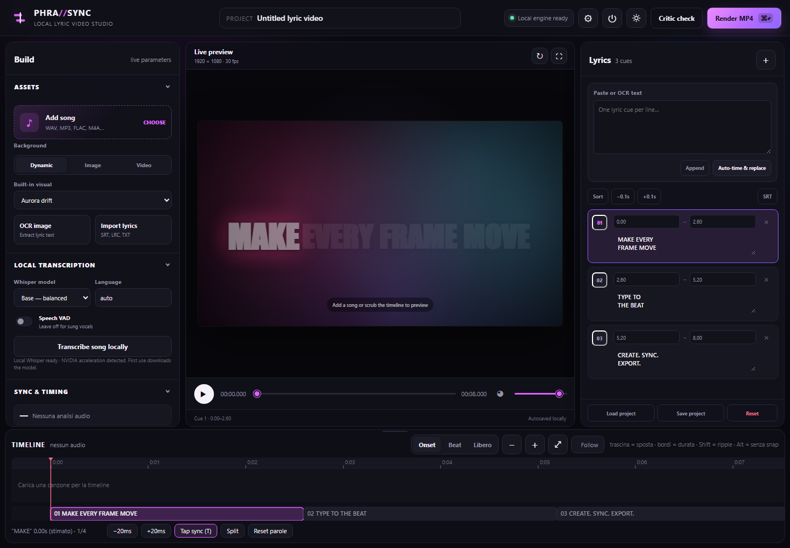
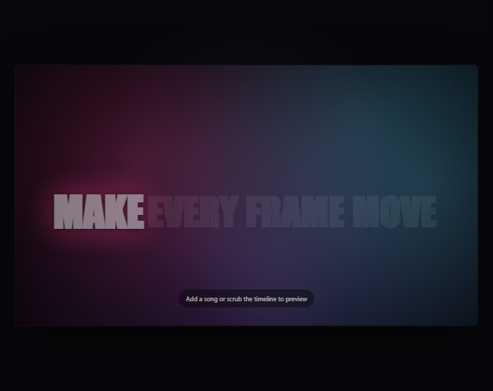
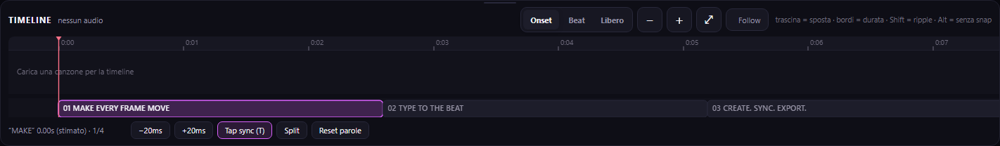
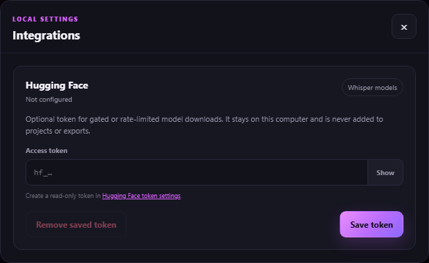

<p align="center">
  
</p>

<h1 align="center">Phrasync</h1>

<p align="center"><em>Local lyric-video and subtitle studio. Every word in time, nothing leaves your machine.</em></p>

<p align="center">Created by <strong>jaydemks</strong>.</p>

> [!IMPORTANT]
> Phrasync v0.1.0 is an experimental first release. Expect rough edges, evolving workflows, and breaking changes.

<p align="center">
  <a href="docs/media/phrasync-demo.mp4"><strong>▶ Watch the high-quality Phrasync demo</strong></a>
</p>

Phrasync has two focused workflows. **Lyric Video** turns a song into beat-aware kinetic typography. **Subtitles** takes an audio or video source, transcribes speech locally, lets you correct every cue, and can burn the result directly into an MP4. Both live in the same local editor, with word-level timing, subtitle-file export, live preview, and no cloud upload.

This is an honest first public version, built in only a few focused iterations. It already produces strong, usable results, but it is not pretending to be finished: the output needs more signature styles and finer art direction, while the transcription workflow can still become more sophisticated. The baseline is already strong: using `large-v3`, the application correctly transcribed three different songs in three different languages for the app demo. The next step is deeper control and refinement, not repairing a broken transcription system.

<table>
  <tr>
    <td width="50%"><a href="docs/media/editor-overview.png"></a><br><sub>The complete local editor</sub></td>
    <td width="50%"><a href="docs/media/kinetic-preview.png"></a><br><sub>Live kinetic preview</sub></td>
  </tr>
  <tr>
    <td width="50%"><a href="docs/media/timeline-editor.png"></a><br><sub>Phrase and word timing</sub></td>
    <td width="50%"><a href="docs/media/local-ai-settings.png"></a><br><sub>Optional model-download settings</sub></td>
  </tr>
</table>

## Why it exists

Most lyric-video tools are either a cloud subscription, a fixed template, or a general-purpose video editor. Phrasync is for musicians and creators who want a focused workflow, local media, editable word timing, and a repeatable export.

The strongest parts today are:

- local processing after the model has been downloaded;
- a waveform timeline with phrases, individual words, vocal onsets, beats, snapping, ripple edits, tap sync, and fine nudging;
- separate Lyric Video and Subtitles modes, including one-step video-as-source and video-as-background setup;
- seven kinetic 2D presets shared by the browser preview and Python export engine;
- seven purpose-labelled 3D typography personalities planted in world space rather than attached to the camera, with independent horizontal and vertical world offsets;
- an Odyssey WebGL environment with four themed worlds, weather, daytime, seasons, and a deterministic automatic journey;
- dynamic, image, and looping-video backgrounds;
- OCR, SRT/LRC/VTT/TXT/JSON import, and a hierarchical local Faster-Whisper pipeline that maps language changes, verifies individual phrases, selectively re-reads disagreements, and reports suspicious segments;
- critic/preflight checks and a real H.264 MP4 export through FFmpeg;
- local autosave plus human-readable project JSON.

### Deliberate technology choices

The first release keeps the runtime small and vendors only Three.js for Odyssey. Its existing scene graph, fog, lighting, points, and line primitives are enough for deterministic rain, snow, storms, leaves, seasonal colour and time-of-day transitions. The official [Three.js Sky addon](https://threejs.org/docs/pages/Sky.html) remains an option for more physically based atmospheric scattering later.

Three open-source projects were evaluated but are not bundled in v0.1.0:

- [Troika Three Text](https://github.com/protectwise/troika/tree/main/packages/troika-three-text) is the strongest next step for high-quality SDF text, kerning, joined scripts, bidirectional layout, and broad Unicode fallback in 3D.
- [JASSUB](https://github.com/ThaUnknown/jassub) and its underlying [libass](https://github.com/libass/libass) are the serious route to pixel-faithful ASS subtitle preview in the browser.
- [three.quarks](https://github.com/Alchemist0823/three.quarks) is a capable MIT-licensed VFX system, but it would be unnecessary weight for the deterministic weather effects already implemented here.

## Quick start

### Windows

1. Install [Python 3.11 or 3.12](https://www.python.org/downloads/) and enable the Python launcher during setup.
2. Clone or download this repository into a normal writable folder.
3. Double-click `run_windows.bat`.
4. Wait while the first run creates `.venv` and installs the packages.
5. Phrasync opens at `http://127.0.0.1:5500`.

### Linux

```bash
git clone https://github.com/jaydemks/phrasync.git
cd phrasync
chmod +x run_linux.sh scripts/*.sh
./run_linux.sh
```

### macOS

```bash
git clone https://github.com/jaydemks/phrasync.git
cd phrasync
chmod +x run_macos.command scripts/*.sh
./run_macos.command
```

On the first macOS launch, you may need to Control-click `run_macos.command` and choose **Open**.

The launcher installs the core app and local AI dependencies. If you only want the editor and export engine, use `scripts/install_core_windows.bat` on Windows or `scripts/install_core_unix.sh` on Linux/macOS. The AI pack can be added later with the matching `install_ai_*` script.

Windows is the platform physically tested for this release. Linux and macOS launchers are included but still need release-machine verification.

## What the first run needs

- Python 3.10–3.12; 3.11 is the best-tested choice.
- Internet access while Python packages are installed.
- Internet access the first time each Whisper model is selected.
- Enough disk space for the environment, temporary renders, and the chosen model.
- FFmpeg. A compatible executable is normally supplied by `imageio-ffmpeg`; a system FFmpeg installation also works.

You normally **do not need a Hugging Face token** for public Whisper models. If a download is gated or rate-limited, create a read-only token and save it under **Settings**. It remains in the local Phrasync settings file and is not placed in saved projects or exports.

Model downloads can take a while and may appear quiet at first. Start with `tiny` or `base` to verify the setup; move to `small`, `medium`, or `large-v3` only when the machine and the material justify it.

## Hardware

These are practical expectations, not vendor-certified limits.

| | Practical minimum (estimate) | Recommended |
| --- | --- | --- |
| CPU | Modern 4-core 64-bit CPU | 6 or more modern cores |
| RAM | 8 GB | 16 GB or more |
| GPU | Not required for 2D; CPU transcription is slower | NVIDIA CUDA GPU with 6 GB+ VRAM and WebGL 2 support |
| Storage | 5 GB free for the app and smaller models | 10–20 GB free for models, media, and temporary renders |
| Output | 720p or short 1080p projects | 1080p editing and export |

An RTX 3060-class GPU is a sensible target for local Whisper work, but it has **not** been benchmarked as part of this release. Lower-end cards can still be useful with smaller models. The editor and exporter also work without an NVIDIA GPU; transcription simply falls back to CPU.

The GPU accelerates Faster-Whisper and the live Odyssey WebGL preview. The current offline MP4 renderer is Pillow plus FFmpeg/libx264 and is primarily CPU-bound, so a faster GPU does not automatically make MP4 export faster.

### Machine used for this release

The current release was developed and checked on:

- Windows 11 Pro;
- AMD Ryzen 9 3900X, 12 cores / 24 threads;
- 32 GB RAM;
- NVIDIA GeForce RTX 3090 with 24 GB VRAM;
- Python 3.11.2;
- FFmpeg available locally;
- Faster-Whisper with CUDA detected.

A representative 2-second export at 1920×1080, 30 fps, H.264 CRF 18/`medium`, with a dynamic background and kinetic text completed in **11.47 seconds** on that machine. This is a smoke benchmark, not a promise for full songs or other hardware.

## Two simple workflows

### Lyric Video

1. Select **Lyric Video** and add a WAV, MP3, FLAC, M4A, OGG, AAC, or Opus song.
2. Import lyrics, run OCR, transcribe locally, or type the words.
3. Run audio analysis and **Auto-align**, then review phrase and word timing.
4. Pick a kinetic 2D look or a grounded 3D personality, then choose the background and art direction.
5. Run **Critic check** and render a supported 2D MP4, or export timed SRT/VTT/ASS/LRC data.

### Subtitles

1. Select **Subtitles** and add an audio file or a video containing speech.
2. Use an MP4 (H.264/AAC) or WebM source for reliable browser playback. Phrasync checks decoding before upload, then uses the video for playback, transcription, preview, background, and the transcoded final audio track.
3. Transcribe locally or import SRT/VTT/TXT, then correct text and timing on the timeline.
4. Choose a clear typography preset and position it over the footage.
5. Export SRT, WebVTT, ASS, enhanced LRC or LRC, or render an MP4 with the subtitles burned into the picture.

On the material tested so far, `large-v3` correctly transcribed three songs in three different languages. It was also validated repeatedly on a 244.9-second code-switching song: Auto mapped Italian, Portuguese, French, Spanish, English, and Japanese, recovered the opening lyrics, preserved Japanese writing, followed late line-level language changes, and produced no false outro after the final vocal. Phrasync still exposes the text and timing because a serious creative tool should let the user inspect, refine, and art-direct the result instead of hiding it behind a one-click process.

Auto is the recommended starting point. It listens across the full track in ten-second windows, smooths uncertain detections into stable spans, places switches near quiet boundaries, decodes each span with its language locked, and then checks every detected phrase. If a phrase disagrees with the first map, Phrasync selectively re-reads the sung region instead of decoding the instrumental intro, bridge, or outro again.

## Save, load, and export: what is verified

The current automated and browser checks cover:

- project JSON save and load;
- preservation of title, timing, cues, canvas, background, and style values;
- clearing stale analysis when another project is loaded;
- dynamic, image, and short looping-video backgrounds;
- custom fonts;
- exports with and without audio;
- cue duration longer than a stale project duration;
- asynchronous render creation, status polling, and download through the API;
- full decode and duration postflight checks;
- browser playback, control edits, adding cues, and a save/load round trip.
- a single video asset used simultaneously as subtitle source, picture, and final audio;
- every 2D/3D-text × dynamic/image/video composition state (real video decoding is covered separately by the MP4 integration render);
- 3D fly-past lifecycle at 20%, 100%, and 260% speed;
- weather, daytime, season, automatic environment changes, and dedicated 3D preset presentation.

The current environment reports **50 passing automated tests**. The hierarchical language mapper, per-span and per-phrase decoding, fixed and restricted language modes, Japanese cue composition, transcription gauntlet, alignment boundaries, export, API, timing, QA, server, settings, subtitle, project-mode, English-copy, and frontend checks pass. The Chrome gauntlet reports zero browser exceptions across its 3D combination matrix.

The engineering export paths have been verified with short renders, but a complete song-length lyric video has not been exported yet. Full output videos are planned using the same songs shown in the app demo, alongside their future Spotify releases.

Saved project files intentionally stay small: they contain editing data and references to media in the local Phrasync workspace. They do **not** embed the song, background video/image, or custom font. Reopening on the same computer/workspace works; moving a project to another computer also requires moving and re-importing its media. A portable project bundle is future work.

## Timing tools

| Action | Result |
| --- | --- |
| Drag a block | Move a phrase or word |
| Drag an edge | Change its start or end |
| `Shift` + drag | Ripple following timing |
| `Alt` + drag | Temporarily disable snapping |
| `Ctrl` + wheel | Zoom around the pointer |
| Wheel | Pan |
| Double-click | Seek |
| `T` | Tap the next word at the playhead |
| `Shift` + `←` / `→` | Nudge the selected word by 20 ms |
| `S` | Split the phrase |
| `W` | Select the word under the playhead |

Preview timing in `static/kinetic.js` and export timing in `phrasync/kinetic.py` are tested against each other field by field.

## Current limits

- Automatic language mapping and phrase-level verification improve code-switching material, but expressive singing, unusual pronunciation, heavy effects, and closely related languages can still require human review.
- The included looks are useful, but the output needs more art direction, presets, and per-element control.
- Rendering is CPU-heavy and can be slow for long 1080p/4K projects.
- Odyssey Flat, Odyssey 3D, and 3D text are currently live-preview features. The preflight blocks them for MP4 instead of silently producing an output that differs from the preview. Switch to a supported dynamic background and Flat text for final MP4 rendering.
- No complete song-length output video has been produced yet; current export validation uses shorter technical renders.
- Project JSON references local assets instead of creating one portable archive.
- Browser video preview intentionally accepts MP4 and WebM. Convert MOV, MKV, AVI, and unusual codecs first; FFmpeg support alone does not guarantee that Chrome can decode the preview.
- There is no signed installer, auto-updater, or polished one-click release yet.
- The web interface is local; this repository is not a static GitHub Pages application.

Those are priorities, not hidden caveats. The first release is already useful, and the next gains should come from a more sophisticated transcription workflow, more distinctive output, portable projects, and easier packaging.

## Diagnostics and development

Run the environment check:

```bat
.venv\Scripts\python.exe scripts\doctor.py
```

Linux/macOS:

```bash
.venv/bin/python scripts/doctor.py
```

Run all tests with `scripts/run_tests_windows.bat` or `./scripts/run_tests_unix.sh`.

To audit a difficult song directly with the same local transcription gauntlet used by the app:

```bat
.venv\Scripts\python.exe scripts\qa_transcription.py "C:\path\to\song.wav" --model large-v3 --language auto
```

`auto` builds and refines a language map across the track. A single ISO code such as `it` locks the whole source; a comma-separated list such as `it,en,ja` keeps automatic mapping inside known candidates; `single` detects one language and keeps it fixed. `multilingual` is accepted as an explicit alias for unrestricted mapping. Phrasync always requests transcription, never translation.

With the app running, the deterministic browser gauntlets can also be run directly:

```bat
.venv\Scripts\python.exe scripts\qa_3d_matrix.py --url http://127.0.0.1:5500
.venv\Scripts\python.exe scripts\qa_scene.py --url http://127.0.0.1:5500 --visual scene3d --text-space scene --weather rain --daytime sunset --season autumn --time 1.3
```

The original editor and renderer monoliths have been split by responsibility. The main app fragments and render modules are now below 400 lines each; the paired kinetic engines, timeline engine, stylesheet, and FastAPI entry point remain larger where keeping the behavior together is currently clearer. The goal is maintainability, not winning a line-count contest.

To capture fresh documentation screenshots while the app is running:

```bat
.venv\Scripts\python.exe scripts\capture_readme.py
```

## Local data and privacy

Phrasync binds to `127.0.0.1` by default. Imported media, projects, renders, settings, and downloaded models stay on the machine. No cloud inference API is required. Network access is used for dependency and model downloads.

Use the power button in the top bar or `Ctrl+C` in the launcher terminal to stop the server cleanly. Closing only the browser tab does not stop the local backend.

## License, attribution, and ownership

Phrasync is open-source software licensed under the **Apache License 2.0**. You may use it privately or commercially, study it, modify it, and redistribute it under those terms. See [LICENSE](LICENSE).

Phrasync was created by **jaydemks**. Source and binary redistributions, including derivative works, must preserve the applicable copyright and attribution notices and include a readable copy of [NOTICE](NOTICE) as required by Apache-2.0. This is attribution through the distributed software or its documentation; it does not require a splash screen, watermark, or credit in videos made with Phrasync.

Videos rendered with Phrasync belong to their creators; the application claims no ownership over output. You are still responsible for the rights to music, lyrics, images, footage, and fonts used in a project.

Contributions submitted for inclusion are licensed under Apache-2.0 unless explicitly stated otherwise. The license grants broad software rights but does not grant ownership of the Phrasync name or branding beyond reasonable use when describing the project's origin.

Third-party components keep their own licenses. In particular, packaged FFmpeg builds may be GPL-enabled. Anyone shipping a portable binary must preserve notices and satisfy the license terms of the exact FFmpeg build being distributed; see [THIRD_PARTY_NOTICES.md](THIRD_PARTY_NOTICES.md).

Release-specific changes and verified limits are recorded in [RELEASE_NOTES.md](RELEASE_NOTES.md).

## Troubleshooting

- If the browser does not open, visit `http://127.0.0.1:5500` and read the launcher terminal.
- If port 5500 is busy, Phrasync selects the next available port unless `--strict-port` is used.
- If CUDA or cuDNN is unavailable, transcription falls back to CPU.
- If model installation fails, start the core editor and install the AI pack later.
- If export fails, run `scripts/doctor.py`, then inspect the critic report and source media.
- Very large resolutions, long songs, and large Whisper models require more time, RAM, VRAM, and disk space.
