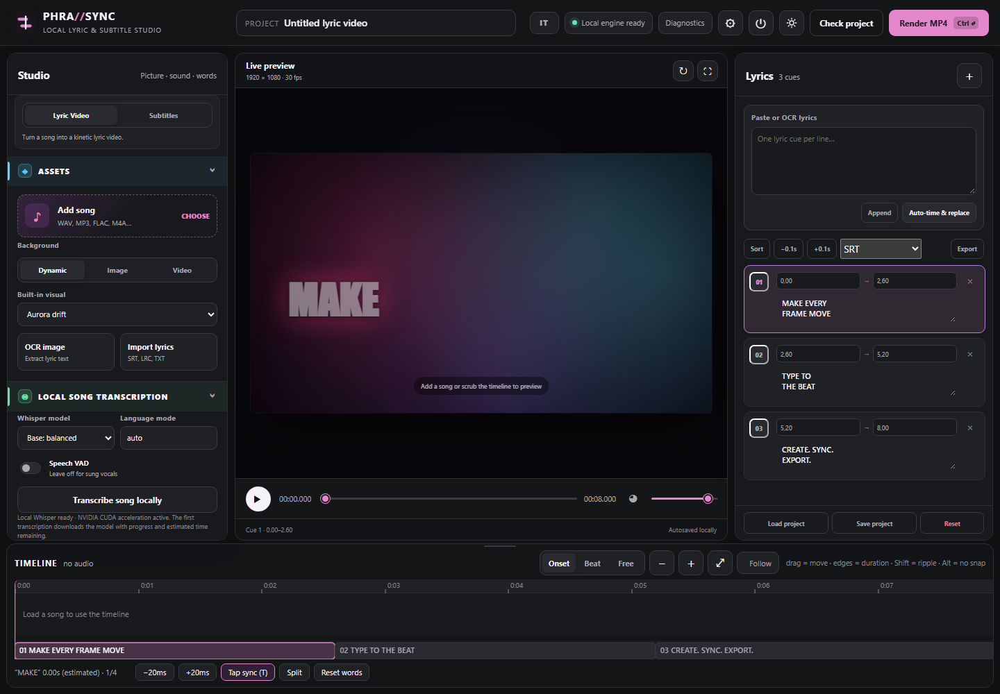
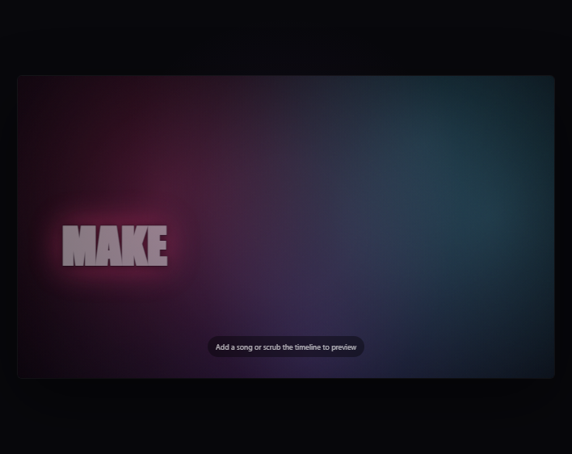
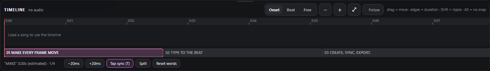
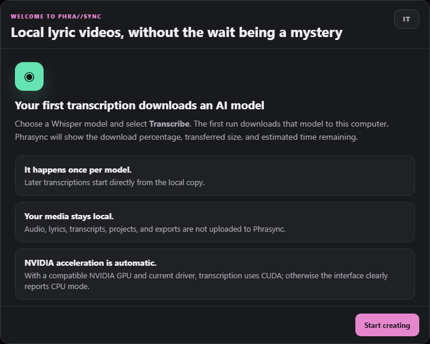

# Phrasync

Phrasync is a free, local studio for lyric videos and subtitles. Bring in a song or video, transcribe it on your computer, correct the words and their timing, choose how it looks, and export an MP4. Your media is not uploaded to a Phrasync service.

Created by [jaydemks](https://github.com/jaydemks).

## Watch Phrasync in action

https://github.com/user-attachments/assets/9ec2387b-2c79-4257-980f-3e578a12f39b

## What you can make

**Lyric videos:** Import a song, transcribe vocals locally or paste/import your own lyrics, then arrange phrases and individual words against the waveform. Choose kinetic 2D text or 3D text that moves through the scene. Use a still image, looping video, reactive background, or an Odyssey 3D world. The worlds include Japan, Italy, China, the United States, and **Lost in the Ocean**, with camera movement, time of day, weather, and art-direction controls.

**Subtitled videos:** Import video or audio, generate editable captions, and burn them into an MP4. A video can serve as the transcription source, preview picture, and final video/audio source in one workflow. The import and audio-analysis path supports long-form projects and files up to 16 GB; actual processing and export time depend on your hardware, codec, and available disk space. Browser preview works most reliably with MP4 (H.264/AAC) or WebM.

In both modes you can:

- Correct text, add or remove cues, and adjust word and phrase timing with dragging, snapping, nudging, tap sync, and auto-align. Manually added lines remain visible even when they overlap a transcription (fixed in 0.4.4).
- Build an edit from a media bin: drag images, videos and built-in 2D/3D visuals onto up to four background tracks. Move, trim, split or duplicate clips, adjust opacity and transitions, and animate pan/zoom. Right-click a clip for quick controls; unused tracks can be removed without deleting your source media.
- Add black-and-white, gradients, particles and an audio-reactive spectrum; trigger shake, pendulum motion, flashes, zoom drops and light pulses from beats or detected transients. Spiral Flight and Word Constellation work with both 2D and 3D text. Flash effects are optional and can affect photosensitive viewers.
- Set export IN/OUT with **I/O**, draggable timeline markers or exact seconds to render just a section. Timeline length follows your media automatically or can be set manually. Zoom stays at the playhead; middle-mouse dragging and the scrollbar let you move around.
- Use local Faster-Whisper transcription, automatic language detection, and optional NVIDIA CUDA acceleration. The interface is in English by default, with an Italian toggle.
- Import lyrics or captions, extract text from an image with OCR, and export subtitle files including SRT, WebVTT, LRC, word-level LRC, and ASS karaoke.
- Preview your work, save and reload a local project, run the preflight check, and export H.264 MP4. In the Windows app you can choose a render folder before export and open either that folder or the default one afterward.
- Use **File → New / Load / Save** with Windows file dialogs and keyboard shortcuts. Choose the destination for subtitle exports too. MP4 export requires a chosen folder, writes one named file, and supports a custom bitrate such as 150 Mbps; a compatibility encoder helps with 4K when the browser codec is unavailable.
- Open **Diagnostics** to inspect errors and relevant Windows/hardware details before sharing a support report.

The editor, timeline, and first-run explanation are shown here:

| Preview | Timeline | First run |
| --- | --- | --- |
|  |  |  |

**0.4.5** adds the footage/visual-track editor, creative overlays and typography, export IN/OUT and custom timeline length. It also improves file dialogs, 4K/custom-bitrate export and protection against extreme repeated-token transcription loops that could push later lyrics out of time. Settings now includes the app version, author contacts and optional coffee support; the welcome popup can be hidden on future launches. The [release notes](RELEASE_NOTES.md) cover these changes and earlier fixes.

## Get Phrasync

**Microsoft Store:** [Install the free Windows app](https://apps.microsoft.com/detail/9NF9JBG2PKHX). The Store build packages the same local editor in a dedicated window with Windows file dialogs and an in-app update check. GitHub and Store releases use the same version line; Store availability follows Microsoft's certification and rollout. The 0.4.5 Windows package is being prepared for submission, so the Store may still offer an earlier version. Check the listing for the version currently available.

**GitHub source:** The current source release is [v0.4.5](https://github.com/jaydemks/phrasync/releases/tag/v0.4.5). On Windows, install [Python 3.11 or 3.12](https://www.python.org/downloads/) with its `py` launcher, clone or download the repository, and run `run_windows.bat`. The first launch installs dependencies. For the same editor in your local browser, run `.venv\Scripts\python.exe app.py --external-browser` after setup. The GitHub release has source code, not a ready-to-install Windows package. Linux and macOS launch scripts are included but are not release-tested like Windows.

Phrasync began as a local browser editor. The Windows app is a more convenient way to install and use it; both modes share the same code and local engine. You can modify the open-source project and run your changes in either mode. You cannot directly edit the installed Store package.

If you have a Store installation older than 0.4.3, back up important projects and reinstall once when 0.4.3 or later becomes available; this clears stale app data that could leave controls unresponsive after an in-place update. Subsequent Store builds can check for updates under **Settings → App updates**. That installation flow still needs confirmation with a later live Store update.

## First run and practical limits

The first transcription downloads the selected speech model to your computer. Phrasync shows its progress, size, and estimated time remaining; later uses of that model work from the local copy. Internet access is needed to install dependencies and download a new model, not to upload your media. Smaller models run with less memory; a compatible NVIDIA GPU speeds up transcription, while CPU mode also works. MP4 rendering, particularly long or high-resolution video, can still take substantial time and disk space.

Automatic transcription and alignment are starting points, not a replacement for listening and checking the result—especially with expressive singing, effects, or mixed languages. Saved project files refer to local media rather than embedding every source file, so move the media too if you move a project to another computer.

To run the automated tests from a Windows source checkout, use `scripts/run_tests_windows.bat`.

## License

Phrasync is open source under [Apache-2.0](LICENSE). Preserve [NOTICE](NOTICE) and applicable [third-party notices](THIRD_PARTY_NOTICES.md) when redistributing it. Videos you create remain yours, subject to your rights in the music, lyrics, footage, images, and fonts you use.
